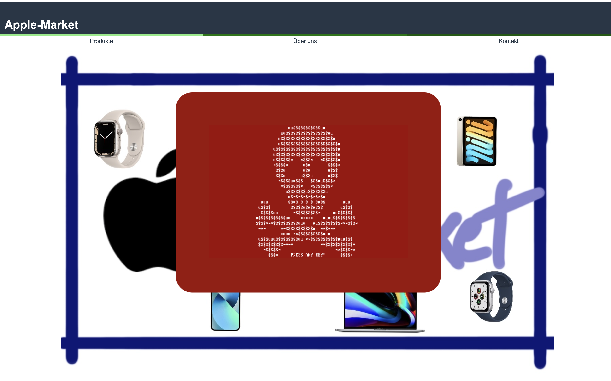

# Support Fraud Simulation

This project involves the replication of a website within the realm of Support Fraud. Victims are deceived into believing that their computer is infected with a virus when accessing such websites. To maintain authenticity, the perpetrators employ tactics such as:

- Overloading browser cache (slowing down or crashing the browser)
- Processor overload
- RAM memory overload

The uploaded files allow the recreation of such a website for testing purposes.

**Note:**
The automatic opening of pop-up windows in the browser has been unblocked for implementation purposes. Most search engines are equipped with numerous security features today, making it nearly impossible to overload a PC via a website.

## Description

The main webpage is stored in `Apple-Market.html`. After 5 seconds, numerous pop-up windows open. Each of these windows executes the `script.js` file. The JavaScript file performs computationally intensive mathematical operations, leading to a system crash in 2-3 minutes, depending on the system. It is recommended to test the crash in a virtual machine (VM).



## Prerequisites

- Linux VM with network settings: Bridged Network (providing the VM with a standalone IP locally)
- Execute the included `setup.sh` on this VM
- Start the webserver with: `sudo systemctl start apache2`
- Access the IP address of the webserver from a second VM

## Troubleshooting

### Issues with Execution

- Directly display the HTML page with the webserver's IP address:
  - Move the files to the apache2 folder (`mv path/to/files /var/www/html`)
  - Delete the current index file (`sudo rm /var/www/html/index.html`)
  - Change the default path in the configs (`sudo nano /etc/apache2/apache2.conf`)
    - Add: `DirectoryIndex Apple-Market.html`

### Apache2 Configuration for JavaScript File Execution

- Open the Apache2 config (`sudo nano /etc/apache2/apche2.conf`)
- Add:
  ```
  AddType application/javascript .js
  AddType text/javascript .js
  ```
- Save the file with: "Control + X," "Y," and "Enter"
- Navigate only with arrow keys

Enjoy exploring the simulation responsibly!
